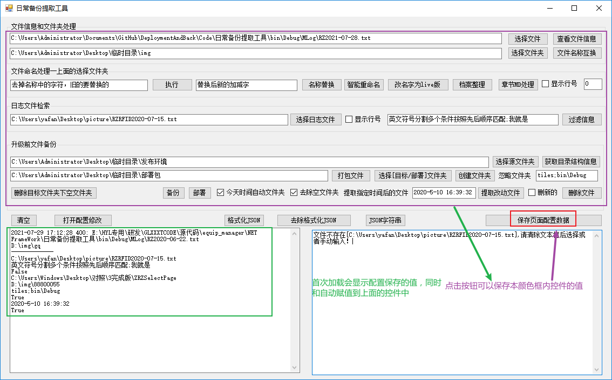

启动工具--双击启动即可

# 备份打包部署及还原功能

## 1、基础配置

截图的界面会随着修改[^RCJL]

`代码就不要放了`

> 界面的设计以功能为主，后续优化显示及可操作性
>
> > 注意测试过程就是使用过程
> >
> > 所有操作的目的就是解决问题，先动手为主

## 2、提取

## 3、备份

备份和提取类似，区别是完整备份，忽略时间

> 根据需要自由选择备份或者提取
>
> > 完整的选择备份
> >
> > 差异化的选择提取

## 4、打包

## 5、部署

## 6、还原

参照5的4蓝色部分说明

## 7、打包-部署-还原 方案

1、先选择源文件夹，就是修改的文件的主目录，

2、在目标部署文件--就是打包后要放得位置
3、复制svn提交的文件信息到左下角的大文本框，

4 、点击打包文件，成功后自动打开所在的文件夹
5、将这个文件夹的名字是日期格式，将这个文件夹复制到服务器上

6、服务器打开本工具，  先选择源文件夹，就是服务的文件的主目录  7、在目标部署文件--就是打包复制到服务器的那个文件夹 （步骤5的）
7、点击部署，自动复制 打包文件进行部署，同时自动备份原始文件到  打包文件（步骤5的根目录下）
8、 步骤6和7可以重复执行，
9、还原操作，先步骤6，然后选择在目标部署文件--（步骤5的根目录下）的zdback_开头的文件夹，点击部署即可完成还原

# 辅助功能

1、格式化json和反格式化，字符串生成

2、快速生成制定的目录结构

[^RCJL]:注重日常习惯的积累，减少重复学习和验证过程!!!